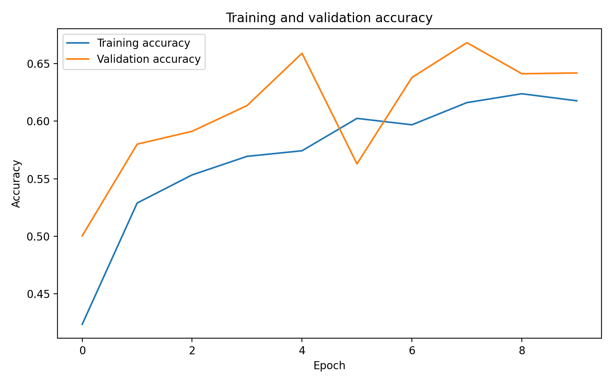
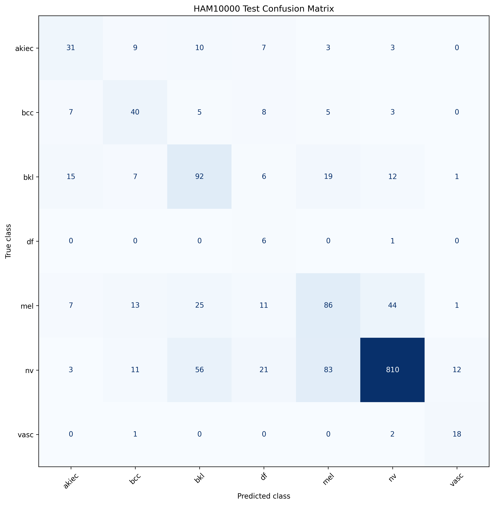
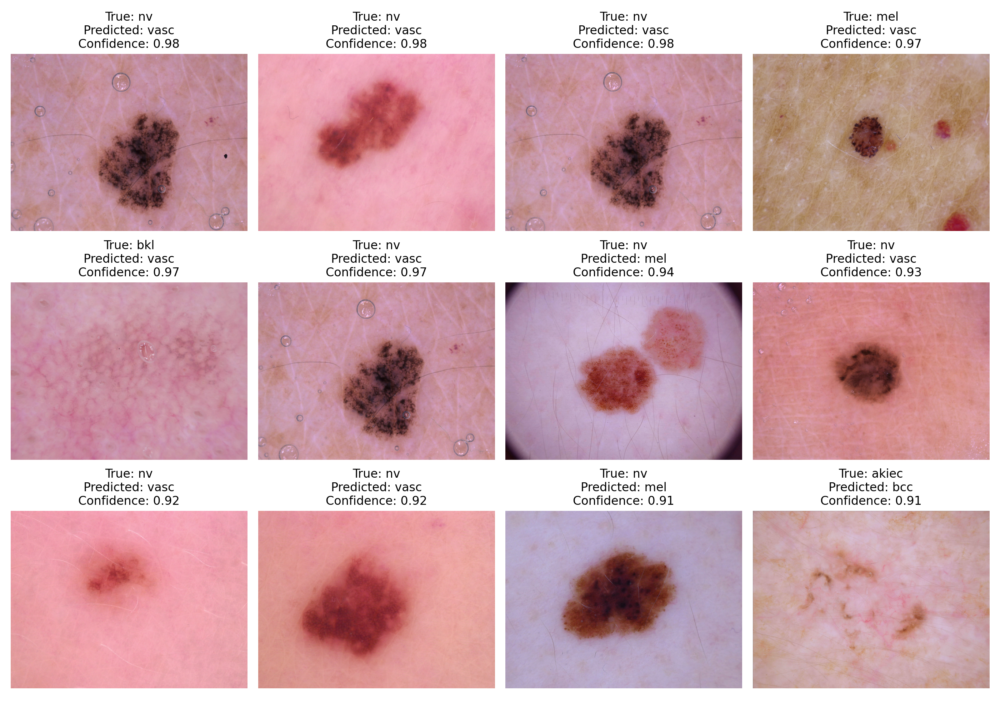

# Live Website
https://shashankpadala43267.github.io/HAM10000-Skin-Lesion-Classifier/
# HAM10000 Skin Lesion Image Classifier

An educational deep learning project that classifies dermoscopic skin lesion images from the HAM10000 dataset using **EfficientNetB0** and **TensorFlow**.

> **Disclaimer:** This project was created for educational and research purposes only. It is **not** a medical diagnostic system and should never be used to make healthcare decisions.

---

# Project Overview

This project explores medical image classification using transfer learning with EfficientNetB0.

The complete machine learning workflow includes:

- Downloading the HAM10000 dataset
- Exploring metadata and class distribution
- Mapping image paths
- Leakage-aware train/validation/test splitting
- TensorFlow data pipelines
- Image augmentation
- EfficientNetB0 transfer learning
- Model training
- Model evaluation
- Confusion matrix analysis
- High-confidence error analysis

---

# Dataset

**Dataset:** HAM10000 (Human Against Machine with 10,000 Training Images)

Number of classes: **7**

Classes:

- akiec — Actinic keratoses
- bcc — Basal cell carcinoma
- bkl — Benign keratosis-like lesions
- df — Dermatofibroma
- mel — Melanoma
- nv — Melanocytic nevi
- vasc — Vascular lesions

Dataset Split

- Training Images: **7002**
- Validation Images: **1519**
- Testing Images: **1494**

---

# Model

Architecture:

- EfficientNetB0
- TensorFlow / Keras
- Transfer Learning
- Data Augmentation

---

# Evaluation Results

| Metric | Value |
|--------|------:|
| Test Accuracy | **41.70%** |
| Balanced Accuracy | **59.20%** |
| Macro F1 Score | **33.52%** |
| Macro Recall | **59.20%** |

These results demonstrate the challenges of multiclass medical image classification and severe dataset imbalance. The project emphasizes understanding the complete machine learning workflow rather than producing a clinically usable model.

---

# Training Accuracy



---

# Confusion Matrix



---

# High-Confidence Incorrect Predictions



---

# Repository Structure

```text
HAM10000/
│
├── figures/
│   ├── accuracy_graph.png
│   ├── confusion_matrix.png
│   └── high_confidence_mistakes.jpeg
│
├── models/
│   ├── best_ham10000_model.keras
│   └── HAM10000_EfficientNetB0_Final.keras
│
├── notebook/
│   └── HAM10000_Skin_Lesion_Classifier.ipynb
│
├── results/
│   ├── HAM10000_results.json
│   ├── HAM10000_mistakes.csv
│   └── HAM10000_test_predictions.csv
│
├── MODEL_CARD.md
├── README.md
└── requirements.txt
```

---

# Technologies Used

- Python
- TensorFlow
- Keras
- EfficientNetB0
- NumPy
- Pandas
- Matplotlib
- Scikit-learn
- Google Colab
- KaggleHub

---

# Skills Demonstrated

- Computer Vision
- Deep Learning
- Transfer Learning
- TensorFlow
- Data Preprocessing
- Dataset Splitting
- Medical Image Analysis
- Model Evaluation
- Error Analysis
- Confusion Matrix Interpretation
- Machine Learning Documentation

---

# Project Limitations

This project has several important limitations:

- The dataset is highly imbalanced.
- Performance varies significantly across lesion classes.
- The model produces some high-confidence incorrect predictions.
- Results may not generalize outside the HAM10000 dataset.
- The model has **not** been clinically validated.
- Predictions are based only on images and do not include patient history or clinical information.

---

# Future Improvements

Possible future work includes:

- Grad-CAM visual explanations
- Improved handling of class imbalance
- Focal Loss
- Hyperparameter optimization
- Additional CNN architectures (ResNet50, MobileNetV2)
- Precision-Recall curves
- ROC curves
- Interactive web application
- Model comparison experiments

---

# Author

**Shashank Padala**

High school student interested in:

- Artificial Intelligence
- Computer Vision
- Biomedical Engineering
- Medicine
- Machine Learning
- Software Engineering

---

# Educational Disclaimer

This repository is an educational machine learning project created to demonstrate deep learning techniques using publicly available data.

It **must not** be used for:

- Medical diagnosis
- Clinical decision making
- Patient screening
- Treatment recommendations
- Replacing a licensed healthcare professional

Always consult a qualified medical professional for medical advice.
